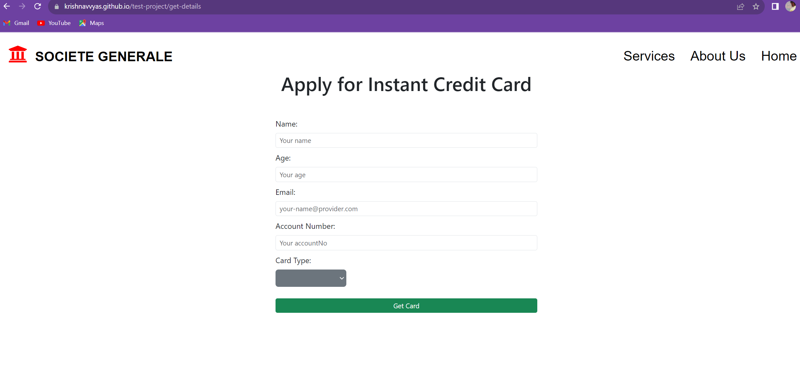
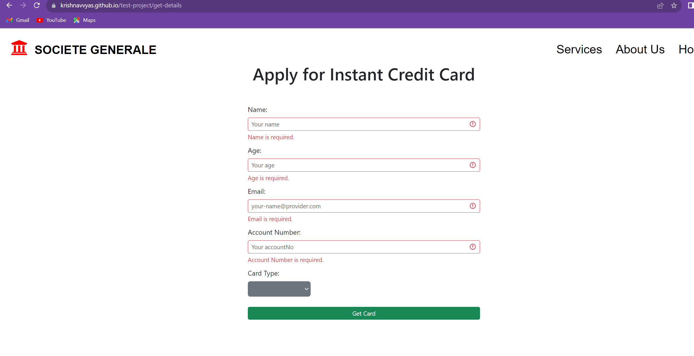

# Project description

## Card Management

Application consists of - 

1. Home Page -> Company logo and name(clickable - i.e. when clicked navigates to home page), Navigation bar (Home, Srvices, about us), Type of cards(with hover effect only), and apply for credit card button.
2. Services -> Services offered by the company with hover effect.
3. About Us - Details about the company.
4. On click of get credit card now from home page -> Customer details form opens up -> customer fills the data (All the field are mandatory & customer cannot order same type of credit card on same account number)
5. On click of Get Card, If all the details are valid -> Customer would be navigated to a dummy card status page.

## Coding standards
1. Lazy loading concept has been used.
2. Common component for header nav bar - HeaderDetailsComponent is used across all the pages to access common navigations.
3. Common stylings are placed in style.scss to follow DRY principle.
4. Bootstrap is used for stylings.
5. Interface IUser in CustomerDetailsFormComponent to demostrate use of Types, Interface.
6. Unit test for UserLandingPageComponent and HeaderDetailsComponent is written. Note: Due to time contraints complete code coverage isn't achieved.

## Some UI screenshots

## Note

Please ignore the content of all the pages. Content is copied fron internet just to represent blocks.